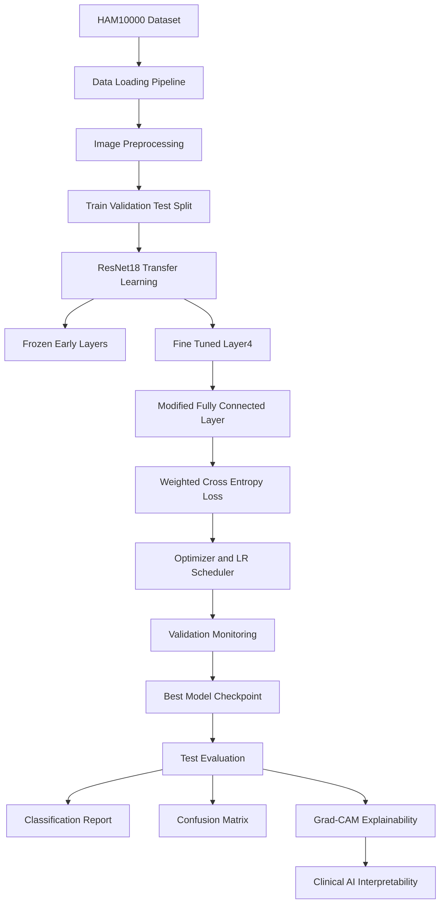
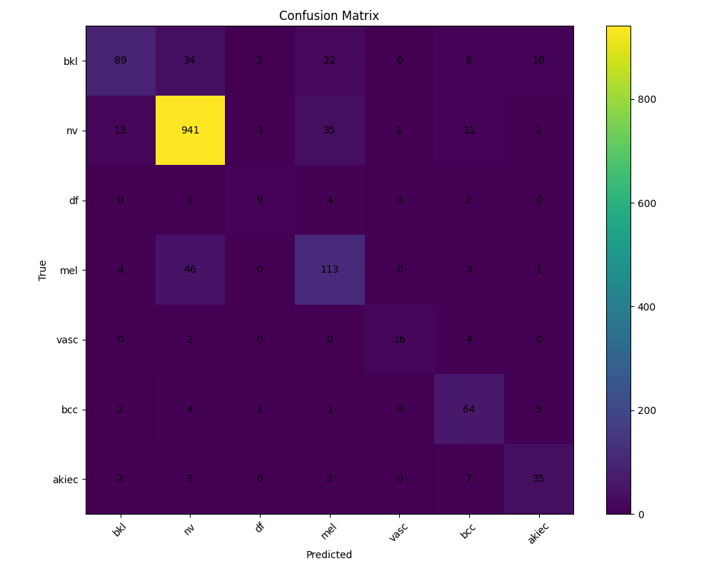
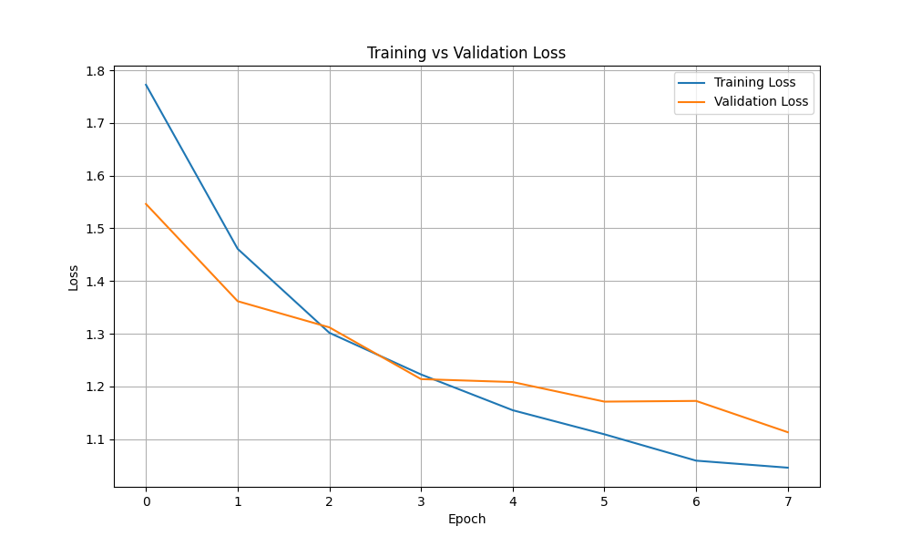
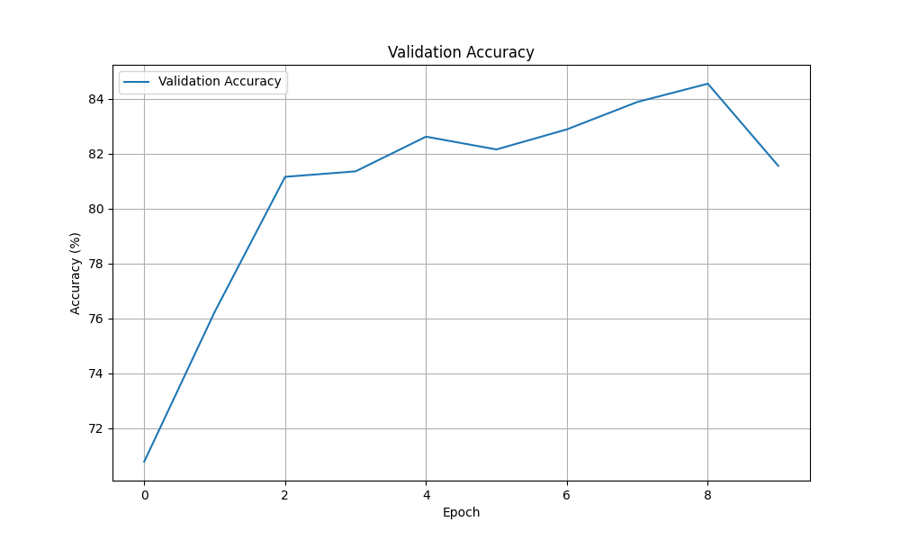
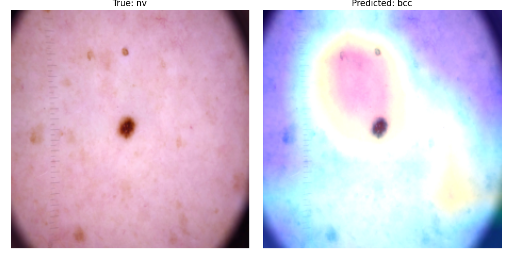
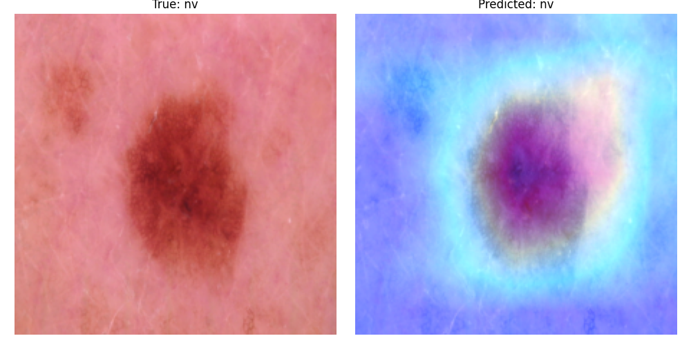
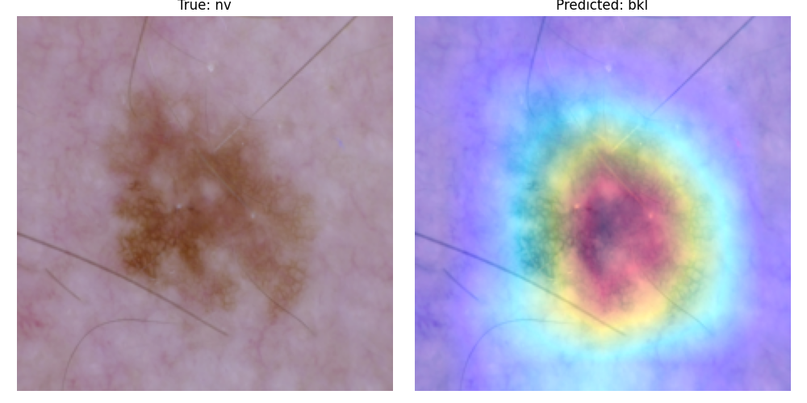
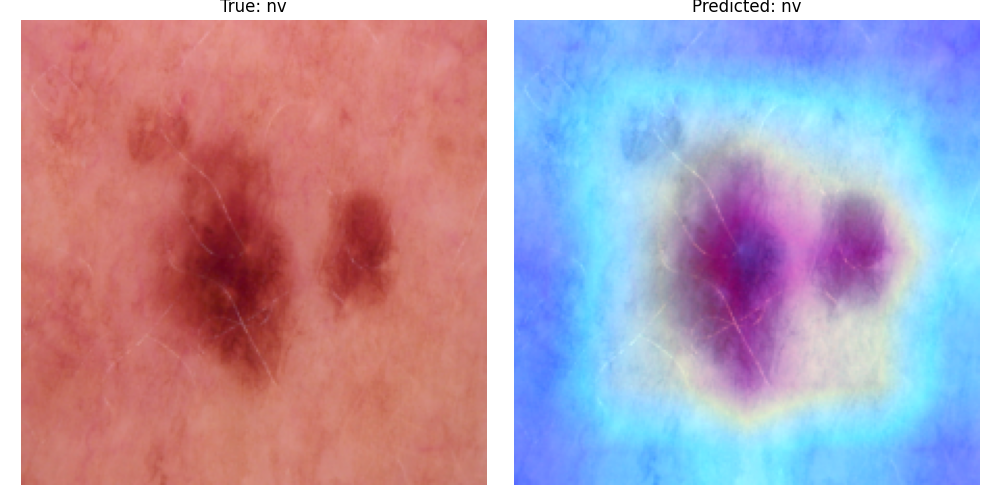
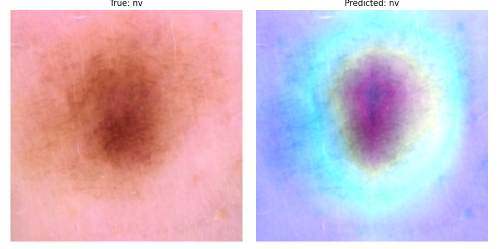

# Clinical AI Reliability

## Explainable Deep Learning for Skin Lesion Classification Using ResNet18 and Grad-CAM

---

# Project Overview

This project investigates the reliability, interpretability, and performance of deep learning models for clinical skin lesion classification using the HAM10000 dermatology dataset.

The system combines:

- Transfer Learning
- Partial Fine-Tuning
- Explainable AI (Grad-CAM)
- Early Stopping
- Weighted Loss Functions
- Learning Rate Scheduling
- Medical Image Classification

The primary objective is to improve trustworthy AI systems for healthcare applications by combining strong predictive performance with interpretable visual explanations.

---

# Dataset

Dataset Used:

## HAM10000
(Human Against Machine with 10000 Training Images)

The dataset contains 7 diagnostic skin lesion categories:

| Label | Description |
|---|---|
| nv | Melanocytic nevi |
| mel | Melanoma |
| bkl | Benign keratosis-like lesions |
| bcc | Basal cell carcinoma |
| akiec | Actinic keratoses |
| vasc | Vascular lesions |
| df | Dermatofibroma |

---

## Dataset Statistics

| Property | Value |
|---|---|
| Total Images | 10,015 |
| Classes | 7 |
| Resolution | 224 × 224 |
| Image Type | Dermoscopic Images |

---

## Dataset Split

| Split | Percentage |
|---|---|
| Train | 70% |
| Validation | 15% |
| Test | 15% |

---

# Model Architecture

## Base Model

- ResNet18 pretrained on ImageNet

## Transfer Learning Strategy

The project uses partial fine-tuning:

- Early layers frozen
- Final ResNet block (`layer4`) unfrozen
- Final classification layer replaced

Final classifier:

```python
nn.Linear(512, 7)
```

---

# System Architecture



---

# Training Features

The training pipeline includes:

- Transfer Learning
- Partial Fine-Tuning
- Data Augmentation
- Weighted Cross-Entropy Loss
- Early Stopping
- ReduceLROnPlateau Scheduler
- Validation Checkpointing
- Experiment Tracking
- Confusion Matrix Generation
- Grad-CAM Explainability

---

# Best Experimental Results

| Metric | Value |
|---|---|
| Test Accuracy | 84.30% |
| Weighted F1 Score | 0.84 |
| Macro F1 Score | 0.72 |

---

# Classification Report

| Class | Precision | Recall | F1-Score |
|---|---|---|---|
| bkl | 0.81 | 0.54 | 0.65 |
| nv | 0.91 | 0.94 | 0.92 |
| df | 0.60 | 0.53 | 0.56 |
| mel | 0.64 | 0.68 | 0.66 |
| vasc | 0.94 | 0.73 | 0.82 |
| bcc | 0.65 | 0.83 | 0.73 |
| akiec | 0.66 | 0.71 | 0.69 |

---

# Results

## Confusion Matrix



---

## Loss Curve



---

## Validation Accuracy



---

# Explainable AI with Grad-CAM

Grad-CAM visualizations were generated to improve model interpretability and identify image regions contributing most strongly to predictions.

The heatmaps demonstrate that the model focuses primarily on lesion regions and clinically relevant structures.

---

## Grad-CAM Examples

### Example 1



---

### Example 2



---

### Example 3



---

### Example 4



---

### Example 5



---

# Project Structure

```plaintext
clinical-ai-reliability/
│
├── data/
├── models/
│   └── best_model.pth
│
├── plots/
│   ├── confusion_matrix.png
│   ├── loss_curve.png
│   ├── validation_accuracy.png
│   └── gradcam/
│       ├── sample_1.png
│       ├── sample_2.png
│       ├── sample_3.png
│       ├── sample_4.png
│       └── sample_5.png
│
├── reports/
│   ├── classification_report.txt
│   ├── confusion_matrix.csv
│   └── test_metrics.txt
│
├── src/
│   ├── data_loader.py
│   ├── train.py
│   └── gradcam.py
│
├── requirements.txt
├── README.md
└── .gitignore
```

---

# Installation

Clone repository:

```bash
git clone https://github.com/VenuYerramsetti/clinical-ai-reliability.git
```

Move into project:

```bash
cd clinical-ai-reliability
```

Create virtual environment:

```bash
python -m venv venv
```

Activate environment:

Mac/Linux:

```bash
source venv/bin/activate
```

Install dependencies:

```bash
pip install -r requirements.txt
```

---

# Running Training

```bash
python src/train.py
```

---

# Running Grad-CAM

```bash
python src/gradcam.py
```

---

# Research Contributions

This project demonstrates:

- Reliable medical image classification
- Explainable AI for healthcare
- Deep learning interpretability
- Transfer learning optimization
- AI transparency in clinical systems
- Clinical decision support potential

---


# Reliability and Clinical Considerations

Although the proposed system achieved strong classification performance, several important reliability considerations remain for real-world healthcare deployment.

## Dataset Imbalance

The HAM10000 dataset contains significant class imbalance, with some lesion categories being substantially underrepresented. While weighted loss functions improved minority class learning, imbalance may still affect model robustness and calibration.

## Generalization Challenges

The model was trained and evaluated on a single dermatology dataset. Performance may vary across:

- different clinical institutions,
- imaging devices,
- patient populations,
- skin tones,
- acquisition conditions.

External validation on diverse datasets is necessary before clinical deployment.

## Explainability Limitations

Grad-CAM provides visual explanations of model attention regions; however, saliency maps do not guarantee causal reasoning. Explainability methods may sometimes highlight correlated regions rather than medically meaningful evidence.

Therefore, interpretability should support — not replace — clinical judgment.

## Clinical Reliability

Strong predictive performance alone is insufficient for healthcare AI systems. Reliable deployment additionally requires:

- uncertainty estimation,
- calibration analysis,
- clinician evaluation,
- fairness assessment,
- safety validation,
- human-AI interaction studies.

This project represents an exploratory step toward more trustworthy clinical AI systems.

---

# Future Work

Potential future research directions include:

- EfficientNet and Vision Transformer architectures
- Ensemble deep learning systems
- Uncertainty-aware prediction
- Calibration analysis for clinical confidence estimation
- Multimodal learning using patient metadata
- Federated medical AI systems
- Skin tone fairness evaluation
- Human-AI collaborative diagnosis
- Clinician-in-the-loop evaluation
- Real-world clinical deployment studies
- Explainability benchmarking beyond Grad-CAM
- Trustworthy AI validation pipelines for healthcare systems

Future work will focus particularly on uncertainty estimation and reliability-aware clinical AI systems for safer healthcare deployment.

---

# Technologies Used

- Python
- PyTorch
- Torchvision
- NumPy
- Pandas
- Matplotlib
- Scikit-learn
- OpenCV

---


# Key Research Takeaways

This project reinforced several important insights regarding trustworthy healthcare AI systems:

- High predictive accuracy alone is insufficient for clinical deployment
- Explainability improves transparency but does not fully solve reliability concerns
- Medical datasets often contain substantial imbalance and bias challenges
- Transfer learning can significantly improve performance in limited-data medical settings
- Clinical AI systems require interpretability, calibration, and uncertainty awareness
- Trustworthy healthcare AI must prioritize reliability alongside performance

These observations motivated a broader research interest in explainable and reliable AI systems for healthcare applications.

---

# Author

## Venu Madhuri Yerramsetti

AI/ML Research and Graduate School Applicant

### Research Interests

- Medical AI
- Explainable AI
- Clinical Reliability
- Deep Learning
- Computer Vision
- Healthcare AI Systems

---

# License

This project is intended for academic and research purposes.